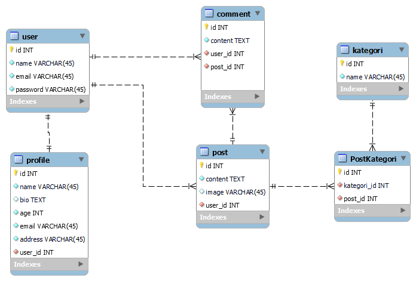

## Tema Project
Forum Tanya Jawab

## ERD Design

- Setiap user memiliki satu profile
- Setiap user dapat post lebih dari satu
- Setiap user dapat komen lebih dari satu post dan setiap post dapat menerima komen dari banyak user
- Setiap kategori dapat memiliki lebih dari satu post dan setiap post dapat memiliki lebih dari satu kategori

## How to deploy on localhost
- Clone repository ini
- Buka terminal pada folder yang sudah di clone
- Jalankan composer update atau composer install
- Buat file .env
- Copy semua yang ada di .env.example lalu past semua pada file .env yang telah dibuat
- Jalankan php artisan key:generate
- Buka XAMPP Control Panel dan aktifkan apache serta mysql
- buka localhost XAMPP di browser
- Buat database baru
- Masuk ke file .env
- Edit Database pada (DB_DATABASE= ) sesuai dengan nama database yang dibuat
- Jalankan php artisan migrate
- Jalankan npm install && npm run dev
- Live di localhost dengan php artisan serve

#### Selamat mencoba
